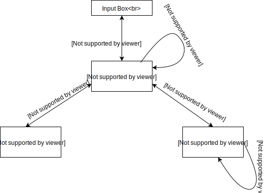
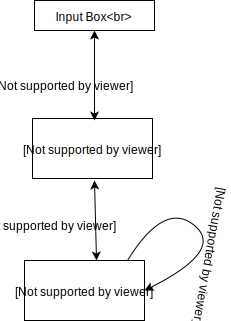
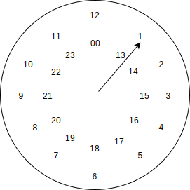
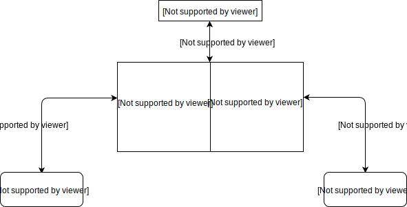

# Date-Picker Component

  A component for date and time with some interactive features.

## Date Picker
- **Input**
    - **Focus** ⟶ Dialog-Box open with Day-Chooser
    - **Unfocus** ⟶ Dialog-Box close
- **Dialog-Box**
    - **Click**
        1. **Left arrow** ⟶ previous month
        2. **Right arrow** ⟶ next month
    - **Keyboard**
        - **arrow up, down, left, right** ⟶ toggle in table(day, month, year)     
    - **Day-Chooser**
        1. **Press Enter** ⟶ set day
        - **Click** 
            1. **Click month** ⟶ month chooser open   
            2. **Click year** ⟶ year chooser open
        - **Scroll**
            1. **Scroll Up** ⟶ next month
            2. **Scroll Down** ⟶ previous month
    - **Month-Chooser**
        1. **Click month** ⟶ set month and open Day-Chooser
        2. **Press Enter** ⟶ set month and open Day-Chooser
    - **Year-Chooser**
        1. **Click year** ⟶ set year and open Day-Chooser
        2. **Press Enter** ⟶ set year and open Day-Chooser
        - **Scroll**
            1. **Scroll Up** ⟶ load previous 3 year
            2. **Scroll Down** ⟶ load next 3 year
### Quick pick
1. **Today**
    - set cuurent date
2. **Yesterday**
    - set previous date
2. **Tomorrow**
    - set next date

### Flowchart

## Month Picker
- **Input**
    - **Focus** ⟶ Dialog-Box open with Month-Chooser
    - **Unfocus** ⟶ Dialog-Box close
- **Dialog-Box**
    - **Keyboard**
        - **arrow up, down, left, right** ⟶ toggle in table(month, year)
    - **Month-Chooser**
        1. **Press Enter** ⟶ set month
        2. **Click month** ⟶ set month
    - **Year-Chooser**
        1. **Click year** ⟶ set year and open Month-Chooser
        2. **Press Enter** ⟶ set year and open Month-Chooser
        - **Scroll**
            1. **Scroll Up** ⟶ load previous 3 year
            2. **Scroll Down** ⟶ load next 3 year
### Quick pick
- **This month**
    - set current month

### Flowchart

## Time Picker(24hours)
- **Input**
    - **Focus** ⟶ Dialog-Box open with Hour-Chooser
    - **Unfocus** ⟶ Dialog-Box close
- **Dialog-Box**
    - **Hour-Chooser**
        1. **Click hour** ⟶ set hour and open Minutes-Chooser
        2. **Drag hour** ⟶ drag tick to select hour
    - **Minutes-Chooser**
        1. **Click Minutes** ⟶ set Minutes and close Dialog-box
        2. **Drag Minutes** ⟶ drag tick to select Minutes
### Diagram

## Time Picker
- **Input**
    - **Focus** ⟶ Dialog-Box open with Hour-Chooser
    - **Unfocus** ⟶ Dialog-Box close
- **Dialog-Box**
    - **Current Time**
        - **Click** ⟶ open Time-Chooser and set time
    - **Current Date**
        - **Click** ⟶ open Date-Chooser and set date

### Quick pick
1. last hour
   - ex ⟶ 12.00 to 1.00
2. privious hour
   - ex ⟶ 12.15 to 1.15

### Flowchart

## Date-Range Pickers
- **Input**
    - **Focus** ⟶ Dialog-Box open with Hour-Chooser
    - **Unfocus** ⟶ Dialog-Box close
- **Dialog-Box**
    Open two date picker with cureent and next month
    1. **Click** ⟶ select a 1st date from 1st date picker
    2. **Click** ⟶ select a 2nd date from 2nd date picker and close Dialog-Box
    - **Css** ⟶ range date selected with a different color

### Quick pick
1. **last 7 days**
    - set date range from current date - 7
2. **Last 30 Days**
    - set date range from current date - 30
3. **This Month**
    - set date of current month 1st date to last date
4. **Last Month**
    - set date of previous month 1st date to last date